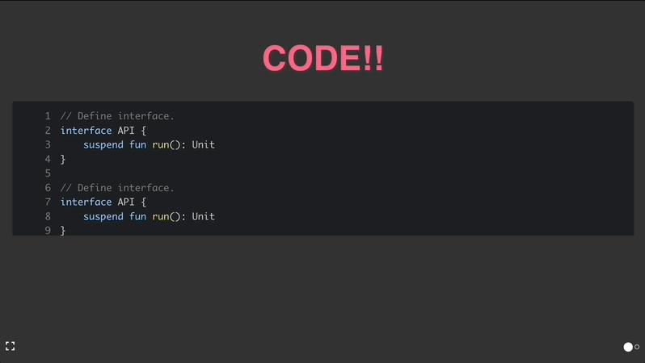

# Spectacle Template

## Spectacle

<p align="center"></p>

[Spectacle](https://formidable.com/open-source/spectacle/)은 코드를 통해 프리젠테이션 발표 자료를 만들 수 있는 [React](https://ko.reactjs.org/) 기반 오픈소스 프로젝트 입니다.
다양한 형태의 컴포넌트를 지원하고, `Presentation Mode`와 `Print Mode` 등 유용한 기능들도 제공합니다.
Spectacle의 더 자세한 내용은 공식 문서를 참고하세요.

## Additional Components

만약 당신이 React에 익숙하다면, Spectacle이 제공하는 컴포넌트를 수정하거나, 당신이 원하는 컴포넌트를 직접 제작할 수 있습니다.
이 프로젝트 템플릿에서는 다음의 추가적인 컴포넌트를 제공합니다.

- **CodePane**

    

    [Code slide](https://github.com/jamiebuilds/spectacle-code-slide)는 프리젠테이션에 코드를 추가하고, 원하는 라인에 주석을 추가할 수 있었습니다. Code Slide는 최신버전의 Spectacle에 통합됐지만, 아쉽게도 주석 기능은 포함되지 않았습니다.
    이 프로젝트에 포함된 CodePane은 유용한 기능인 주석을 제공합니다.
    ```js
    import CodePane from 'component/code-pane/code-pane';

    export default function CodeSlide() {
        return (
            <CodePane
                highlightRanges={[1, [2, 3], 4]}
                descriptions={[
                    "라인 시작",
                    "클래스 선언"
                ]}
            >
            </CodePane>
        )
    }
    ```
    더 자세한 예제는 [여기](https://github.com/OhByeongYun/spectacle-template/blob/main/src/slide/slide1.js#L50)를 참고하세요.
- **Image Preloader**

    당신이 만약 슬라이드에 고화질 이미지를 추가한다면, 슬라이드에 처음 진입할 때 아마 당신의 관중은 빈 화면을 보게될지도 모릅니다.
    이런 상황을 대비해 [Image Preloader](https://github.com/nlarche/boilerplate-spectacle)를 추가해 놓았습니다.
    ```js
    import preloader from 'component/util/preloader';
    import FooImage from 'assets/foo.png';
    import BarImage from 'assets/bar.png';

    preload([FooImage, BarImage]);
    ```
    더 자세한 예제는 [여기](https://github.com/OhByeongYun/spectacle-template/blob/main/src/slide/index.js#L8)를 참고하세요.
